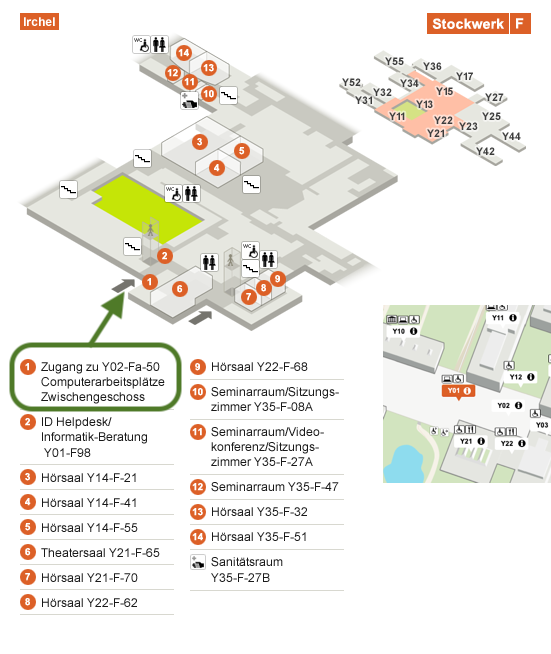

# [BIO392](https://baudisgroup.github.io/BIO392-Github/)

This is a repository for materials related to the BIO392 _Bioinformatics of Genome Variation_ introductory course at the University of Zürich, Autumn 2018.

The home page of this repository can be found at [baudisgroup.github.io/BIO392-Github/](https://baudisgroup.github.io/BIO392-Github/).

## Abstract

One of the fastest growing areas of bioinformatics is in the analysis, warehousing and representation of genomic and protein sequence variants, particularly with view on the use of molecular data in personalised health and biomedical applications in general. This course will engage participants to explore common data formats, online resources and analysis techniques, with a focus on human genome variation data.

#### Links

* BIO392 in the [UZH OLAT](https://lms.uzh.ch/auth/RepositoryEntry/16434233613) system
* BIO392 in the [UZH directory](https://studentservices.uzh.ch/uzh/anonym/vvz/index.html#/details/2018/003/SM/50920456)

#### Literature and Resources

* [Articles and other reading](literature/) (files)
* [Article links](literature-links.md)
* [Resource links](resource-links.md) (browsers and online repositories)
* [Course tasks](tasks.md) (to do's and challenges)

## Schedule

The course schedule consists of 1 afternoon (Tuesday) and 3 "full" days (Wednesday - Friday) in the first two weeks, with 1.5 days in the last week.

The "full days" run from 09:00 - 17:00, with a break from 12:00 - 13:30.

Conceptually, mornings are predominantly related to introductions, presentations and discussion of the previous days, and are afternoons reserved for independent  work on the examples and tasks.

#### Introduction, File Formats & Genome Browsers (Michael Baudis)

##### 2018-09-18 (Tue), 13-17
* general introduction into the topic ([slides](https://info.baudisgroup.org/assets/articles_and_presentations/2018-09-18___Michael_Baudis__BIO392-Introduction-Variants__slides.pdf))
* schedule adjustment
* guidance about course room and computer use (Tina Siegenthaler)
* [reading](https://baudisgroup.github.io/BIO392-Github/literature-links.html):
    - 1000 Genomes paper
    - The sequence of sequencers paper
* [tasks](https://baudisgroup.github.io/BIO392-Github/literature-links.html):
    - Genome Storage Space & Cost

##### 2018-09-19 (Wed), 09-17
* reference genome resources
* [reading](https://baudisgroup.github.io/BIO392-Github/literature-links.html):
    - "Genomics made easier"
    - UCSC genome browser tutorial
* exercise: [UCSC tutorial](https://github.com/baudisgroup/BIO392-Github/blob/master/assets/UCSC_tutorial.md)
* genome editions and coordinates
* [reading](https://baudisgroup.github.io/BIO392-Github/literature-links.html):
    - segment_liftover article
* exercise: genome liftover

##### 2018-09-20 (Thu), 09-17
* Annotating genome variants
* [reading](https://baudisgroup.github.io/BIO392-Github/literature-links.html):
    - HGVS Recommendations (not for details, though)
    - dbVar "Overview of Structural Variation" ([link](https://www.ncbi.nlm.nih.gov/dbvar/content/overview/))
    - [info slides from the morning session](https://baudisgroup.github.io/BIO392-Github/assets/2018-09-20-BIO392-variant-resources-formats.pdf)
* Literature review and discussion

##### 2018-09-21 (Fri), 09-17
* Associating variants with phenotypes and diseases (focus on cancer ...)
    - Use of variant databases and annotation tools (CiVIC, OncoKb, ClinGen, ClinVar...)
* Hands-on analysis of genome data
    - copy number segmentation tutorial

#### Tools & Programmatic Solutions (Izaskun Mallona)

##### 2018-09-25 (Tue), 13-17
* How are UCSC Genome Browser data stored? Why?
* Genomics data management: automation
   - Computer basics: plain text files, Unix terminal
   - Reproducibility
   - Systems set up (installing UCSC Genome Browser Kent utils)

##### 2018-09-26 (Wed), 09-17
* Overview of the standard genomics data formats (I)
   - FASTA
   - FASTQ
   - SAM
   - BED
* Basic file processing for bioinformatics
  - awk, cut

##### 2018-09-27 (Thu), 09-17
* Overview of the standard genomics data formats (II)
  - GFF/GTF
  - BEDgraphs
  - Wiggle files
  - VCFs
* Indexed genomic data formats

##### 2018-09-28 (Fri), 09-17
* Hands-on andaysis of genome data
  - Organizing and visualizing a custom trackhub

#### Genome Variants to Modified Proteins (Elif Özkirimli Olmez)

* 2018-10-02 (Tue), 13-17
* 2018-10-03 (Wed), 09-17
* 2018-10-04 (Thu), 09-17
* 2018-10-05 (Fri), 09-17

#### Review & Write-Up (Michael Baudis)

* 2018-10-09 (Tue), 13-17
* 2018-10-10 (Wed), 09-17
    * Written exam

